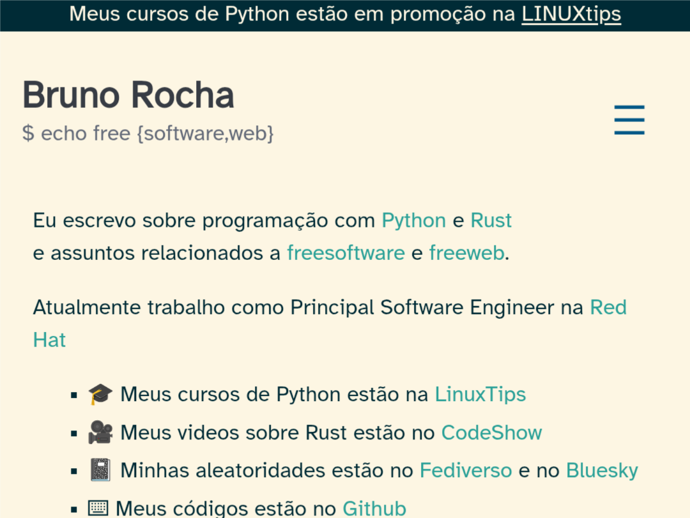
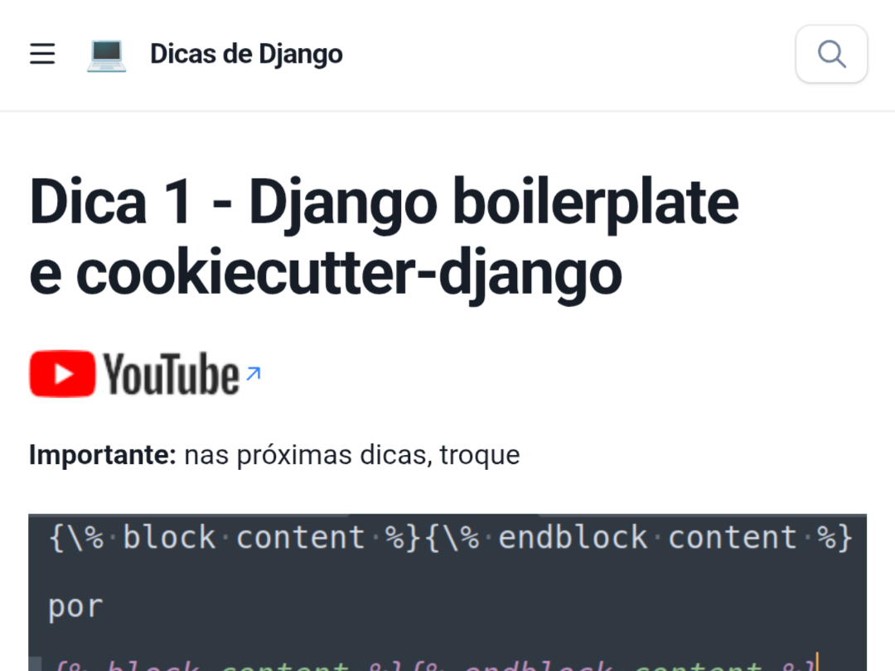
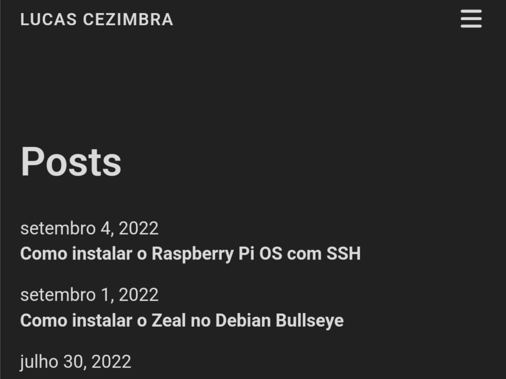
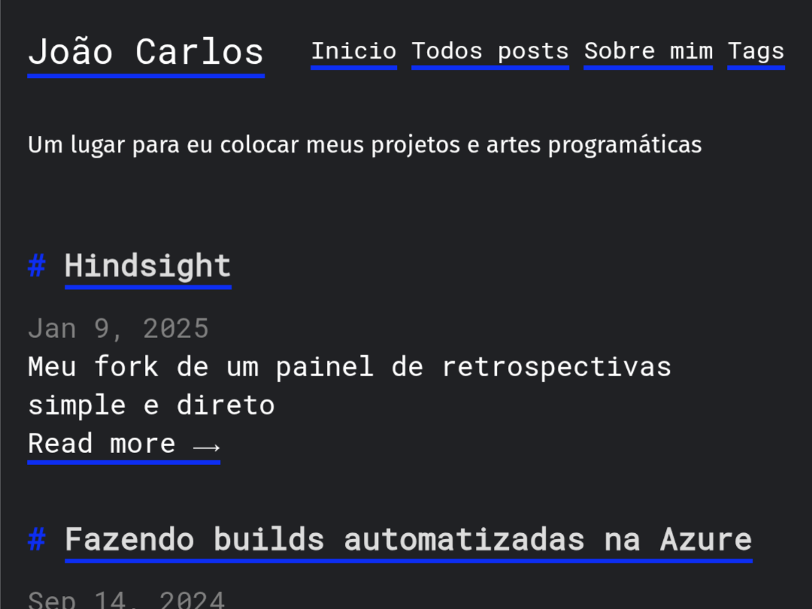
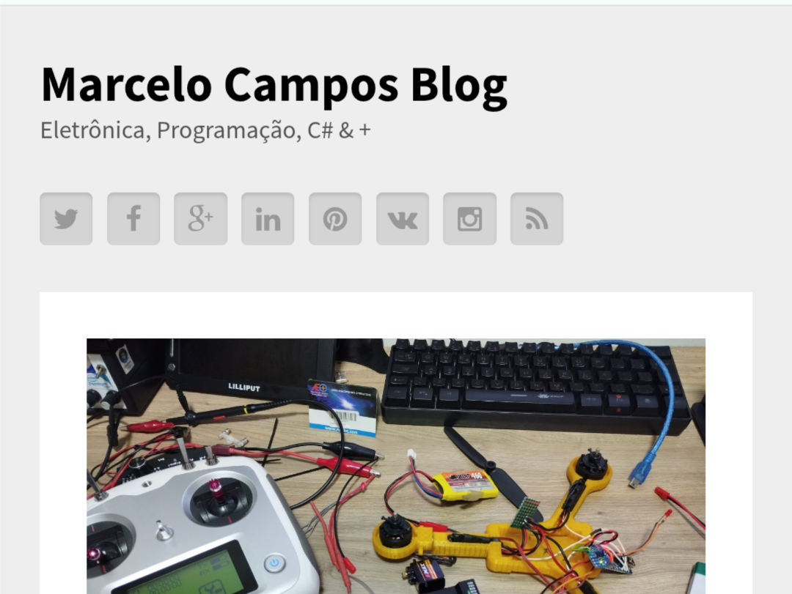
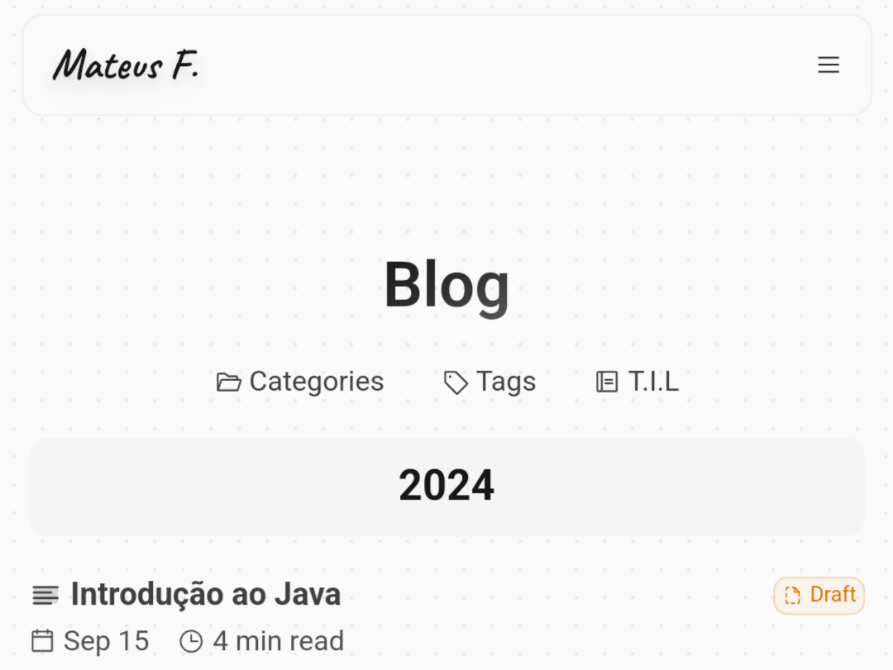
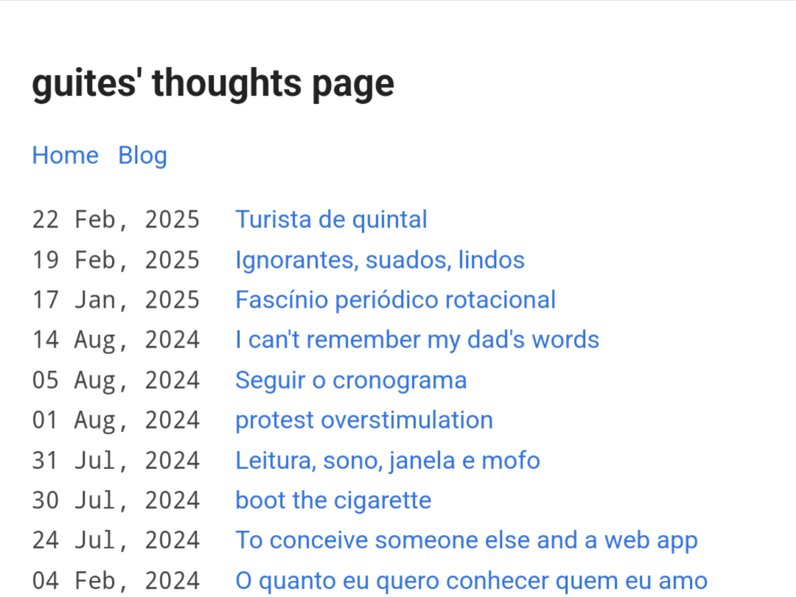
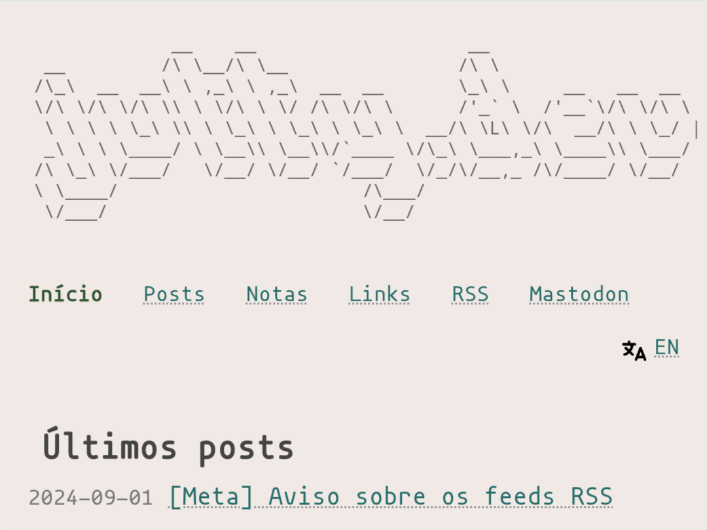
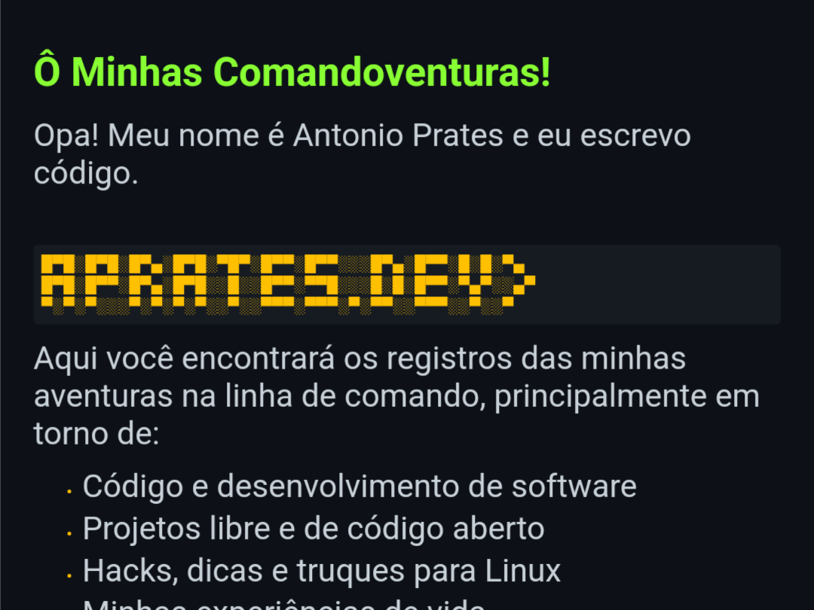

# 🇧🇷 Awesome Brazilian Tech Blogs 

> Blogs técnicos brasileiros feitos por pessoas reais e que valem a pena seguir!

  
  
  

## 📚 Lista de Blogs

| # | Blog | Autor | Preview |
|---|------|-------|---------|
| 1 | [Dunossauro](https://blog.dunossauro.com/) | Dunossauro |  |
| 2 | [Cuducos](https://cuducos.me/blog/) | Eduardo Cuducos |  |
| 3 | [Bruno Rocha](https://rochacbruno.com/) | Bruno Rocha |  |
| 4 | [Dicas de Django](https://www.dicas-de-django.com.br/) | Regis Santos |  |
| 5 | [Lucas Cezimbra](https://cezimbra.me/posts) | Lucas Cezimbra |  |
| 6 | [Helio Loureiro](https://helio.loureiro.eng.br/) | Helio Loureiro |  |
| 7 | [Renato Lond](https://lond.com.br/) | Renato Lond |  |
| 8 | [Fox Tech World](https://foxtechworld.github.io/) | Arthur Augusto |  |
| 9 | [João Carlos Hakaga](https://weblog.hagaka.me/) | João Carlos Hakaga |  |
| 10 | [Marcelo Campos](https://marcelocampos.cc/) | Marcelo Campos |  |
| 11 | [Mateus F.](https://mateusf.com/blog) | Mateus Felipe |  |
| 12 | [Bear Blog - Guites](https://guites.bearblog.dev/blog/) | Guites |  |
| 13 | [Jutty](https://blog.jutty.dev/pt/) | Jutty |  |
| 14 | [Aprates](https://aprates.dev/pt-br/) | Antonio Aprates |  |
| 15 | [Jeiel Blog](https://jeiel0rbit.github.io/jeiel-blog/) | Jeiel Miranda |  |

## 🤝 Como Contribuir

Contribuições são bem-vindas! Siga esses passos:

1. Faça um Fork do projeto
2. Adicione o blog seguindo o mesmo formato da tabela
3. Inclua uma screenshot (4:3) na pasta `previews`
4. Envie um Pull Request

Ou [abra uma issue](https://github.com/seuusuario/awesome-brazilian-tech-blogs/issues) para sugerir melhorias!

## 📜 Licença

Este projeto está licenciado sob a licença GPLv3- veja o arquivo [LICENSE](LICENSE) para detalhes.
